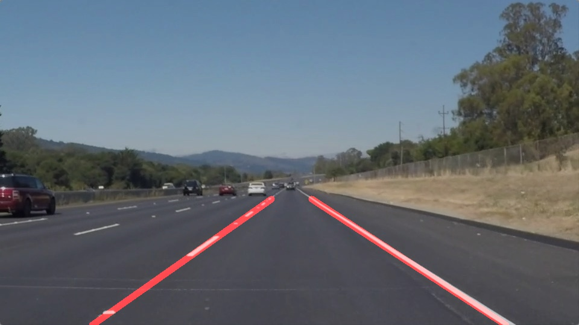

# Lane-Finding
> Please refer to: Self-Driving Car Engineer Nanodegree - Udacity, [Term 1 - Project 1](https://github.com/udacity/CarND-LaneLines-P1)  

### Overview
In this project, you can find a pipeline to identify lane lines on the road, from both images and video. The [code](P1.ipynb) takes road images as input and returns annotated images and video stream.

### Dependencies
This project is stored in a **Jupyter Notebook** and requires **Python 3.5** and **OpenCv** to run.  

### Result
The resulted output files (images and videos) are supplied in the [output](output) directory. Watching the annotated videos requires a preliminary download (or to run the code!).

